# 🔧 Especificaciones Técnicas - Botones de Landing PlanSport

> Documentación técnica detallada para la implementación de la navegación de los botones "Comenzar Gratis" y "Ver Demo" en la landing page.

---

## 📋 Resumen Técnico

### Problema Actual
```typescript
// Estado actual en hero.ts
onStartFree(): void {
  // TODO: Implement registration flow
  console.log('Starting free registration...');
}

onViewDemo(): void {
  // TODO: Implement demo modal or navigation
  console.log('Opening demo...');
}
```

### Solución Propuesta
- Implementar navegación real usando Angular Router
- Integrar con AuthService para detección de estado
- Agregar manejo de errores y estados de loading
- Mejorar UX con feedback visual

---

## 🏗️ Arquitectura de la Solución

### Componentes Involucrados
```
src/app/
├── components/hero/
│   ├── hero.ts          # ← Componente a modificar
│   ├── hero.html        # ← Template a actualizar
│   └── hero.css         # ← Estilos a mejorar
├── features/auth/
│   ├── services/
│   │   └── auth.service.ts  # ← Servicio existente a usar
│   └── guards/
│       └── auth.guard.ts    # ← Guards existentes
└── app.routes.ts        # ← Rutas ya configuradas
```

### Flujo de Datos

```mermaid
graph TD
    A[Usuario hace clic] --> B[Hero Component]
    B --> C{¿Usuario autenticado?}
    C -->|Sí| D[Navegar a /dashboard]
    C -->|No| E[Navegar a /auth]
    E --> F[Agregar query params]
    F --> G[Página de autenticación]
    D --> H[Dashboard]
    G --> I[Login/Register]
```


---

## 💻 Implementación Detallada

### 1. Actualización del Hero Component

#### Imports Necesarios
```typescript
import { Component, inject } from '@angular/core';
import { CommonModule } from '@angular/common';
import { Router } from '@angular/router';
import { AuthService } from '../../features/auth/services/auth.service';
```

#### Estructura del Componente
```typescript
@Component({
  selector: 'app-hero',
  imports: [CommonModule],
  templateUrl: './hero.html',
  styleUrl: './hero.css'
})
export class Hero {
  private router = inject(Router);
  private authService = inject(AuthService);
  
  // Estado para UI
  isNavigating = false;
  
  async onStartFree(): Promise<void> {
    await this.handleNavigation('register');
  }
  
  async onViewDemo(): Promise<void> {
    await this.handleNavigation('login');
  }
  
  private async handleNavigation(tab: 'login' | 'register'): Promise<void> {
    try {
      this.isNavigating = true;
      
      // Verificar si el usuario ya está autenticado
      const isAuthenticated = await this.authService.isAuthenticated();
      
      if (isAuthenticated) {
        // Usuario autenticado → ir al dashboard
        await this.router.navigate(['/dashboard']);
      } else {
        // Usuario no autenticado → ir a auth con tab específico
        await this.router.navigate(['/auth'], { 
          queryParams: { tab } 
        });
      }
    } catch (error) {
      console.error('Navigation error:', error);
      // Fallback: navegar a auth sin verificar autenticación
      await this.router.navigate(['/auth'], { 
        queryParams: { tab } 
      });
    } finally {
      this.isNavigating = false;
    }
  }
}
```

### 2. Actualización del Template

#### Botones con Estados de Loading
```html
<div class="flex flex-col sm:flex-row gap-4 justify-center lg:justify-start">
  <button 
    (click)="onStartFree()"
    [disabled]="isNavigating"
    [class.opacity-50]="isNavigating"
    [class.cursor-not-allowed]="isNavigating"
    class="btn-primary text-lg px-8 py-4 rounded-lg font-semibold transition-all hover:scale-105 disabled:hover:scale-100"
    aria-label="Comenzar registro gratuito en PlanSport">
    
    <span *ngIf="!isNavigating">Comenzar Gratis</span>
    <span *ngIf="isNavigating" class="flex items-center gap-2">
      <svg class="animate-spin h-4 w-4" fill="none" viewBox="0 0 24 24">
        <circle class="opacity-25" cx="12" cy="12" r="10" stroke="currentColor" stroke-width="4"></circle>
        <path class="opacity-75" fill="currentColor" d="m4 12a8 8 0 018-8V0C5.373 0 0 5.373 0 12h4zm2 5.291A7.962 7.962 0 014 12H0c0 3.042 1.135 5.824 3 7.938l3-2.647z"></path>
      </svg>
      Cargando...
    </span>
  </button>
  
  <button 
    (click)="onViewDemo()"
    [disabled]="isNavigating"
    [class.opacity-50]="isNavigating"
    [class.cursor-not-allowed]="isNavigating"
    class="btn-secondary text-lg px-8 py-4 rounded-lg font-semibold border-2 border-primary-600 text-primary-600 hover:bg-primary-600 hover:text-white transition-all disabled:hover:bg-transparent disabled:hover:text-primary-600"
    aria-label="Ver demostración de PlanSport">
    
    <span *ngIf="!isNavigating">Ver Demo</span>
    <span *ngIf="isNavigating" class="flex items-center gap-2">
      <svg class="animate-spin h-4 w-4" fill="none" viewBox="0 0 24 24">
        <circle class="opacity-25" cx="12" cy="12" r="10" stroke="currentColor" stroke-width="4"></circle>
        <path class="opacity-75" fill="currentColor" d="m4 12a8 8 0 018-8V0C5.373 0 0 5.373 0 12h4zm2 5.291A7.962 7.962 0 014 12H0c0 3.042 1.135 5.824 3 7.938l3-2.647z"></path>
      </svg>
      Cargando...
    </span>
  </button>
</div>
```

### 3. Integración con AuthService

#### Verificación de Estado de Autenticación
```typescript
// Método esperado en AuthService
export class AuthService {
  async isAuthenticated(): Promise<boolean> {
    try {
      const token = localStorage.getItem('access_token');
      if (!token) return false;
      
      // Verificar si el token es válido
      const response = await this.http.get('/api/auth/verify').toPromise();
      return response.success;
    } catch {
      return false;
    }
  }
}
```

#### Fallback si AuthService no está disponible
```typescript
private async isUserAuthenticated(): Promise<boolean> {
  try {
    if (this.authService && typeof this.authService.isAuthenticated === 'function') {
      return await this.authService.isAuthenticated();
    }
    
    // Fallback: verificar token en localStorage
    const token = localStorage.getItem('access_token');
    return !!token;
  } catch {
    return false;
  }
}
```

---

## 🎨 Mejoras de UX/UI

### Estados Visuales
```css
/* hero.css - Mejoras adicionales */
.btn-primary:focus-visible,
.btn-secondary:focus-visible {
  @apply ring-2 ring-primary-500 ring-offset-2 outline-none;
}

.btn-primary:disabled,
.btn-secondary:disabled {
  @apply cursor-not-allowed opacity-50;
  transform: none !important;
}

/* Animación suave para loading */
.loading-spinner {
  animation: spin 1s linear infinite;
}

@keyframes spin {
  from { transform: rotate(0deg); }
  to { transform: rotate(360deg); }
}
```

### Iconos Opcionales (con Lucide)
```html
<!-- Si se decide agregar iconos -->
<button class="btn-primary">
  <lucide-icon name="play" class="w-4 h-4 mr-2"></lucide-icon>
  Comenzar Gratis
</button>

<button class="btn-secondary">
  <lucide-icon name="eye" class="w-4 h-4 mr-2"></lucide-icon>
  Ver Demo
</button>
```

---

## 🔒 Consideraciones de Seguridad

### Validación de Rutas
```typescript
private async navigateToAuth(tab: string): Promise<void> {
  // Validar que el tab sea válido
  const validTabs = ['login', 'register'];
  const safeTab = validTabs.includes(tab) ? tab : 'login';
  
  await this.router.navigate(['/auth'], { 
    queryParams: { tab: safeTab } 
  });
}
```

### Manejo Seguro de Tokens
```typescript
private async checkAuthStatus(): Promise<boolean> {
  try {
    // No exponer tokens en logs
    const hasToken = !!localStorage.getItem('access_token');
    if (!hasToken) return false;
    
    // Verificar con el servidor sin exponer el token
    return await this.authService.verifyToken();
  } catch (error) {
    // Log error sin detalles sensibles
    console.error('Auth verification failed');
    return false;
  }
}
```

---

## 🧪 Testing

### Unit Tests
```typescript
describe('Hero Component', () => {
  let component: Hero;
  let router: jasmine.SpyObj<Router>;
  let authService: jasmine.SpyObj<AuthService>;

  beforeEach(() => {
    const routerSpy = jasmine.createSpyObj('Router', ['navigate']);
    const authSpy = jasmine.createSpyObj('AuthService', ['isAuthenticated']);
    
    TestBed.configureTestingModule({
      providers: [
        { provide: Router, useValue: routerSpy },
        { provide: AuthService, useValue: authSpy }
      ]
    });
    
    router = TestBed.inject(Router) as jasmine.SpyObj<Router>;
    authService = TestBed.inject(AuthService) as jasmine.SpyObj<AuthService>;
  });

  it('should navigate to auth/register when user not authenticated', async () => {
    authService.isAuthenticated.and.returnValue(Promise.resolve(false));
    
    await component.onStartFree();
    
    expect(router.navigate).toHaveBeenCalledWith(
      ['/auth'], 
      { queryParams: { tab: 'register' } }
    );
  });

  it('should navigate to dashboard when user authenticated', async () => {
    authService.isAuthenticated.and.returnValue(Promise.resolve(true));
    
    await component.onStartFree();
    
    expect(router.navigate).toHaveBeenCalledWith(['/dashboard']);
  });
});
```

### E2E Tests
```typescript
describe('Landing Page Navigation', () => {
  it('should navigate to registration from Comenzar Gratis button', () => {
    cy.visit('/');
    cy.get('[data-testid="start-free-btn"]').click();
    cy.url().should('include', '/auth?tab=register');
  });

  it('should navigate to login from Ver Demo button', () => {
    cy.visit('/');
    cy.get('[data-testid="view-demo-btn"]').click();
    cy.url().should('include', '/auth?tab=login');
  });
});
```

---

## 📊 Performance

### Optimizaciones
- **Lazy Loading**: AuthService se inyecta solo cuando se necesita
- **Debouncing**: Prevenir múltiples clics rápidos
- **Caching**: Cachear resultado de `isAuthenticated()` por unos segundos

### Métricas Objetivo
- **Time to Navigate**: < 200ms desde clic hasta inicio de navegación
- **Bundle Size Impact**: < 5KB adicionales
- **Memory Usage**: Sin memory leaks en navegación repetida

---

## 🔧 Configuración de Desarrollo

### Proxy para Backend (si es necesario)
```json
// proxy.conf.json
{
  "/api/*": {
    "target": "http://localhost:5000",
    "secure": false,
    "changeOrigin": true,
    "logLevel": "debug"
  }
}
```

### Angular.json Configuration
```json
"serve": {
  "builder": "@angular-devkit/build-angular:dev-server",
  "options": {
    "proxyConfig": "proxy.conf.json"
  }
}
```

---

## 🚀 Deployment

### Build Verification
```bash
# Verificar que el build funciona
ng build --configuration production

# Verificar que no hay errores de TypeScript
ng lint

# Ejecutar tests
ng test --watch=false --browsers=ChromeHeadless
```

### Environment Variables
```typescript
// environment.ts
export const environment = {
  production: false,
  apiUrl: 'http://localhost:5000/api',
  authTimeout: 30000 // 30 segundos
};
```

---

*🔧 Especificaciones Técnicas creadas para PlanSport - Botones de Landing*
*Actualizado: Enero 2025*
*Versión: 1.0*