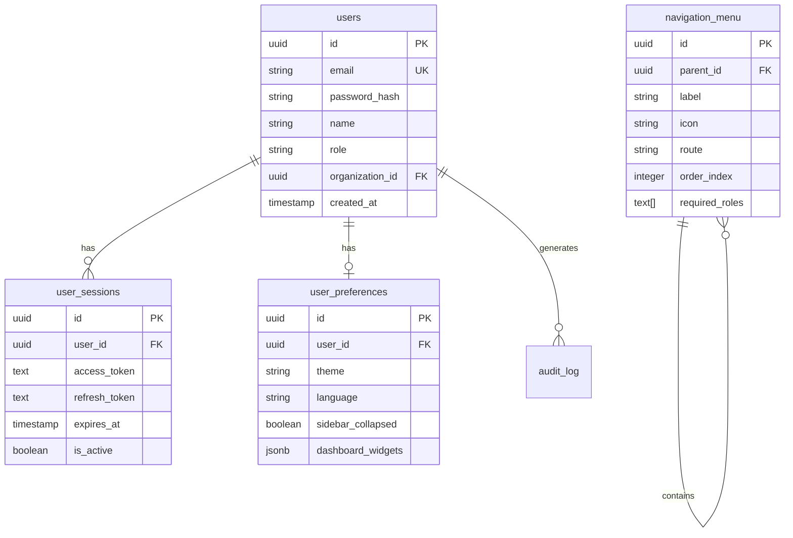

# Database Specification - Dashboard Layout

## Tables Structure

### 1. users
**Description:** Almacena la información de los usuarios del sistema

```sql
CREATE TABLE users (
    id UUID PRIMARY KEY DEFAULT gen_random_uuid(),
    email VARCHAR(255) UNIQUE NOT NULL,
    password_hash VARCHAR(255) NOT NULL,
    name VARCHAR(255) NOT NULL,
    first_name VARCHAR(100),
    last_name VARCHAR(100),
    role VARCHAR(50) NOT NULL CHECK (role IN ('admin', 'director', 'entrenador')),
    avatar_url VARCHAR(500),
    organization_id UUID REFERENCES organizations(id),
    is_active BOOLEAN DEFAULT true,
    last_login TIMESTAMP,
    created_at TIMESTAMP DEFAULT CURRENT_TIMESTAMP,
    updated_at TIMESTAMP DEFAULT CURRENT_TIMESTAMP
);

CREATE INDEX idx_users_email ON users(email);
CREATE INDEX idx_users_organization ON users(organization_id);
CREATE INDEX idx_users_role ON users(role);
```

### 2. user_sessions
**Description:** Gestión de sesiones activas de usuarios

```sql
CREATE TABLE user_sessions (
    id UUID PRIMARY KEY DEFAULT gen_random_uuid(),
    user_id UUID NOT NULL REFERENCES users(id) ON DELETE CASCADE,
    access_token TEXT NOT NULL,
    refresh_token TEXT NOT NULL,
    ip_address VARCHAR(45),
    user_agent TEXT,
    expires_at TIMESTAMP NOT NULL,
    refresh_expires_at TIMESTAMP NOT NULL,
    is_active BOOLEAN DEFAULT true,
    created_at TIMESTAMP DEFAULT CURRENT_TIMESTAMP,
    updated_at TIMESTAMP DEFAULT CURRENT_TIMESTAMP
);

CREATE INDEX idx_sessions_user ON user_sessions(user_id);
CREATE INDEX idx_sessions_token ON user_sessions(access_token);
CREATE INDEX idx_sessions_refresh ON user_sessions(refresh_token);
CREATE INDEX idx_sessions_active ON user_sessions(is_active, expires_at);
```

### 3. user_preferences
**Description:** Preferencias y configuración del usuario

```sql
CREATE TABLE user_preferences (
    id UUID PRIMARY KEY DEFAULT gen_random_uuid(),
    user_id UUID UNIQUE NOT NULL REFERENCES users(id) ON DELETE CASCADE,
    theme VARCHAR(20) DEFAULT 'light',
    language VARCHAR(5) DEFAULT 'es',
    sidebar_collapsed BOOLEAN DEFAULT false,
    notifications_enabled BOOLEAN DEFAULT true,
    email_notifications BOOLEAN DEFAULT true,
    dashboard_widgets JSONB DEFAULT '[]',
    created_at TIMESTAMP DEFAULT CURRENT_TIMESTAMP,
    updated_at TIMESTAMP DEFAULT CURRENT_TIMESTAMP
);

CREATE INDEX idx_preferences_user ON user_preferences(user_id);
```

### 4. navigation_menu
**Description:** Estructura del menú de navegación

```sql
CREATE TABLE navigation_menu (
    id UUID PRIMARY KEY DEFAULT gen_random_uuid(),
    parent_id UUID REFERENCES navigation_menu(id),
    label VARCHAR(100) NOT NULL,
    icon VARCHAR(50),
    route VARCHAR(255),
    order_index INTEGER NOT NULL,
    is_active BOOLEAN DEFAULT true,
    required_roles TEXT[], -- Array de roles permitidos
    created_at TIMESTAMP DEFAULT CURRENT_TIMESTAMP,
    updated_at TIMESTAMP DEFAULT CURRENT_TIMESTAMP
);

CREATE INDEX idx_navigation_parent ON navigation_menu(parent_id);
CREATE INDEX idx_navigation_order ON navigation_menu(order_index);
CREATE INDEX idx_navigation_active ON navigation_menu(is_active);
```

### 5. audit_log
**Description:** Log de auditoría para acciones importantes

```sql
CREATE TABLE audit_log (
    id UUID PRIMARY KEY DEFAULT gen_random_uuid(),
    user_id UUID REFERENCES users(id),
    action VARCHAR(100) NOT NULL,
    entity_type VARCHAR(100),
    entity_id UUID,
    old_values JSONB,
    new_values JSONB,
    ip_address VARCHAR(45),
    user_agent TEXT,
    created_at TIMESTAMP DEFAULT CURRENT_TIMESTAMP
);

CREATE INDEX idx_audit_user ON audit_log(user_id);
CREATE INDEX idx_audit_action ON audit_log(action);
CREATE INDEX idx_audit_entity ON audit_log(entity_type, entity_id);
CREATE INDEX idx_audit_created ON audit_log(created_at);
```

## Seed Data

### Navigation Menu Items
```sql
-- Insertar items del menú principal
INSERT INTO navigation_menu (label, icon, route, order_index, required_roles) VALUES
('Inicio', 'home', '/dashboard', 1, NULL),
('Equipos', 'users', '/teams', 2, NULL),
('Planificaciones', 'calendar-alt', '/planning', 3, NULL),
('Entrenamientos', 'stopwatch', '/training', 4, NULL),
('Objetivos', 'trophy', '/objectives', 5, NULL),
('Ejercicios', 'dumbbell', '/exercises', 6, NULL),
('Marketplace', 'store', '/marketplace', 7, NULL),
('Reportes', 'chart-line', '/reports', 8, ARRAY['admin', 'director']),
('Configuración', 'cog', '/settings', 9, NULL);
```

### Default User (Development)
```sql
-- Usuario de prueba para desarrollo
INSERT INTO users (email, password_hash, name, first_name, last_name, role) VALUES
('admin@plansport.com', '$2b$10$YourHashedPasswordHere', 'Alejandro Ruiz García', 'Alejandro', 'Ruiz García', 'director');

-- Preferencias por defecto
INSERT INTO user_preferences (user_id, theme, language, sidebar_collapsed)
SELECT id, 'light', 'es', false FROM users WHERE email = 'admin@plansport.com';
```

## Relationships



## Indexes Strategy

### Performance Indexes
- `users.email`: Para login rápido
- `user_sessions.access_token`: Para validación de tokens
- `user_sessions.refresh_token`: Para refresh de tokens
- `navigation_menu.order_index`: Para ordenar el menú

### Business Logic Indexes
- `users.role`: Para filtrar por permisos
- `user_sessions.is_active, expires_at`: Para limpiar sesiones expiradas
- `audit_log.created_at`: Para consultas de auditoría por fecha

## Security Considerations

### Password Storage
- Usar bcrypt con salt rounds >= 10
- Nunca almacenar passwords en texto plano
- Implementar política de contraseñas fuertes

### Token Management
```sql
-- Función para limpiar sesiones expiradas
CREATE OR REPLACE FUNCTION cleanup_expired_sessions()
RETURNS void AS $$
BEGIN
    UPDATE user_sessions 
    SET is_active = false 
    WHERE expires_at < CURRENT_TIMESTAMP 
    AND is_active = true;
END;
$$ LANGUAGE plpgsql;

-- Programar ejecución cada hora
CREATE EXTENSION IF NOT EXISTS pg_cron;
SELECT cron.schedule('cleanup-sessions', '0 * * * *', 'SELECT cleanup_expired_sessions()');
```

### Audit Triggers
```sql
-- Trigger para actualizar updated_at
CREATE OR REPLACE FUNCTION update_updated_at_column()
RETURNS TRIGGER AS $$
BEGIN
    NEW.updated_at = CURRENT_TIMESTAMP;
    RETURN NEW;
END;
$$ LANGUAGE plpgsql;

CREATE TRIGGER update_users_updated_at BEFORE UPDATE ON users
    FOR EACH ROW EXECUTE FUNCTION update_updated_at_column();

CREATE TRIGGER update_user_preferences_updated_at BEFORE UPDATE ON user_preferences
    FOR EACH ROW EXECUTE FUNCTION update_updated_at_column();

-- Trigger para auditar cambios importantes
CREATE OR REPLACE FUNCTION audit_user_changes()
RETURNS TRIGGER AS $$
BEGIN
    IF TG_OP = 'UPDATE' THEN
        INSERT INTO audit_log (user_id, action, entity_type, entity_id, old_values, new_values)
        VALUES (NEW.id, 'UPDATE', 'users', NEW.id, row_to_json(OLD), row_to_json(NEW));
    END IF;
    RETURN NEW;
END;
$$ LANGUAGE plpgsql;

CREATE TRIGGER audit_users_changes AFTER UPDATE ON users
    FOR EACH ROW EXECUTE FUNCTION audit_user_changes();
```

## Migrations

### V1__Create_Users_Tables.sql
```sql
-- Crear todas las tablas relacionadas con usuarios y navegación
-- Incluir todos los CREATE TABLE statements anteriores
```

### V2__Add_Audit_System.sql
```sql
-- Agregar sistema de auditoría
-- CREATE TABLE audit_log...
-- CREATE TRIGGERS...
```

### V3__Seed_Navigation_Menu.sql
```sql
-- Insertar datos iniciales del menú
-- INSERT INTO navigation_menu...
```