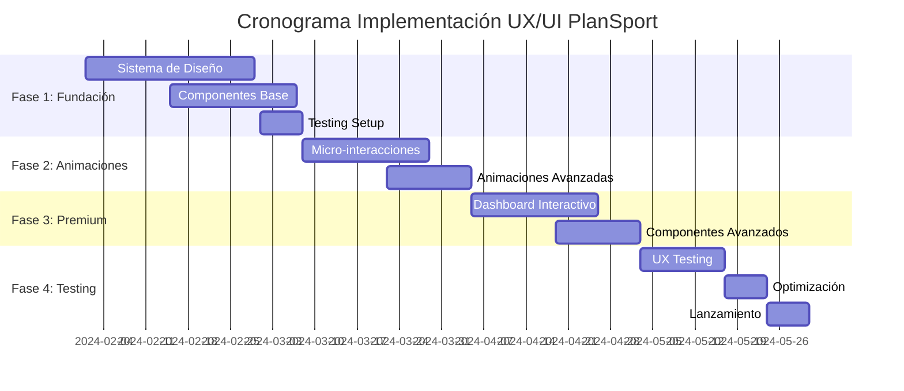

# Plan de Implementación y Presupuesto - Estrategia UX/UI PlanSport

## 1. Resumen Ejecutivo

Este documento presenta un plan detallado para transformar PlanSport en una aplicación con UX/UI de clase mundial, incluyendo cronograma, recursos necesarios, presupuesto y métricas de éxito.

### 1.1 Objetivos Principales
- Aumentar la retención de usuarios en un 40%
- Mejorar la conversión de visitantes a usuarios registrados en un 35%
- Alcanzar un score de Lighthouse superior a 95
- Obtener una calificación de usabilidad superior a 4.5/5

### 1.2 Inversión Total Estimada
- **Nivel Básico**: €15,000 - €25,000
- **Nivel Intermedio**: €25,000 - €45,000
- **Nivel Premium**: €45,000 - €75,000

## 2. Fases de Implementación

### Fase 1: Fundación y Sistema de Diseño (4-6 semanas)

#### 2.1 Objetivos
- Establecer sistema de diseño robusto
- Implementar componentes base mejorados
- Configurar herramientas de desarrollo

#### 2.2 Entregables
- [ ] Sistema de colores y tipografía avanzado
- [ ] Componentes base (Button, Input, Card, Modal)
- [ ] Configuración Tailwind CSS optimizada
- [ ] Guía de estilo y documentación
- [ ] Setup de herramientas de testing visual

#### 2.3 Recursos Necesarios

| Rol | Tiempo | Costo/hora | Total |
|-----|--------|------------|-------|
| UI/UX Designer Senior | 120h | €60 | €7,200 |
| Frontend Developer Senior | 100h | €70 | €7,000 |
| QA Engineer | 40h | €45 | €1,800 |
| **Total Fase 1** | | | **€16,000** |

#### 2.4 Herramientas y Licencias

| Herramienta | Costo Mensual | Costo Anual |
|-------------|---------------|-------------|
| Figma Professional | €12 | €144 |
| Adobe Creative Suite | €60 | €720 |
| Storybook | €0 | €0 |
| Chromatic | €149 | €1,788 |
| **Total Herramientas** | | **€2,652** |

### Fase 2: Mejoras Visuales y Animaciones (3-4 semanas)

#### 2.1 Objetivos
- Implementar micro-interacciones
- Añadir animaciones fluidas
- Mejorar feedback visual

#### 2.2 Entregables
- [ ] Animaciones de entrada y transiciones
- [ ] Micro-interacciones en botones y formularios
- [ ] Loading states y skeleton loaders
- [ ] Efectos hover y focus mejorados
- [ ] Parallax scrolling en hero section

#### 2.3 Recursos Necesarios

| Rol | Tiempo | Costo/hora | Total |
|-----|--------|------------|-------|
| Motion Designer | 80h | €55 | €4,400 |
| Frontend Developer | 120h | €70 | €8,400 |
| UX Researcher | 20h | €50 | €1,000 |
| **Total Fase 2** | | | **€13,800** |

### Fase 3: Componentes Premium y Funcionalidad Avanzada (4-5 semanas)

#### 2.1 Objetivos
- Desarrollar componentes complejos
- Implementar funcionalidades premium
- Optimizar performance

#### 2.2 Entregables
- [ ] Dashboard interactivo con gráficos
- [ ] Sistema de notificaciones avanzado
- [ ] Formularios inteligentes con validación
- [ ] Componentes de visualización de datos
- [ ] PWA capabilities

#### 2.3 Recursos Necesarios

| Rol | Tiempo | Costo/hora | Total |
|-----|--------|------------|-------|
| Frontend Architect | 100h | €85 | €8,500 |
| Data Visualization Specialist | 60h | €75 | €4,500 |
| Performance Engineer | 40h | €80 | €3,200 |
| **Total Fase 3** | | | **€16,200** |

### Fase 4: Testing, Optimización y Lanzamiento (2-3 semanas)

#### 2.1 Objetivos
- Testing exhaustivo de usabilidad
- Optimización de performance
- Preparación para lanzamiento

#### 2.2 Entregables
- [ ] Tests de usabilidad con usuarios reales
- [ ] Optimización de Core Web Vitals
- [ ] Auditoría de accesibilidad completa
- [ ] Documentación técnica final
- [ ] Plan de monitoreo post-lanzamiento

#### 2.3 Recursos Necesarios

| Rol | Tiempo | Costo/hora | Total |
|-----|--------|------------|-------|
| UX Researcher | 60h | €50 | €3,000 |
| Accessibility Expert | 30h | €65 | €1,950 |
| Performance Engineer | 40h | €80 | €3,200 |
| QA Engineer | 50h | €45 | €2,250 |
| **Total Fase 4** | | | **€10,400** |

## 3. Presupuesto Detallado por Niveles

### 3.1 Nivel Básico (€15,000 - €25,000)

#### Incluye:
- Sistema de diseño básico
- Componentes esenciales mejorados
- Animaciones CSS básicas
- Mejoras de accesibilidad
- Testing básico

#### Desglose:
| Categoría | Costo |
|-----------|-------|
| Desarrollo | €12,000 |
| Diseño | €6,000 |
| Testing | €2,000 |
| Herramientas (6 meses) | €1,500 |
| **Total** | **€21,500** |

### 3.2 Nivel Intermedio (€25,000 - €45,000)

#### Incluye todo lo anterior más:
- Micro-interacciones avanzadas
- Componentes premium
- Dashboard interactivo
- Testing de usabilidad
- Optimización móvil avanzada

#### Desglose:
| Categoría | Costo |
|-----------|-------|
| Desarrollo | €20,000 |
| Diseño | €10,000 |
| Motion Design | €4,000 |
| Testing y UX Research | €5,000 |
| Herramientas (12 meses) | €3,000 |
| **Total** | **€42,000** |

### 3.3 Nivel Premium (€45,000 - €75,000)

#### Incluye todo lo anterior más:
- Animaciones 3D avanzadas
- AI-powered personalization
- Advanced analytics
- Realidad aumentada (opcional)
- Consultoría UX continua

#### Desglose:
| Categoría | Costo |
|-----------|-------|
| Desarrollo Avanzado | €30,000 |
| Diseño y Motion | €15,000 |
| Tecnologías Premium | €8,000 |
| UX Research Avanzado | €7,000 |
| Consultoría y Soporte | €5,000 |
| Herramientas Premium (12 meses) | €5,000 |
| **Total** | **€70,000** |

## 4. Tecnologías y Herramientas Premium

### 4.1 Librerías de Animación

| Librería | Propósito | Costo | ROI Esperado |
|----------|-----------|-------|-------------|
| Framer Motion | Animaciones React | €0 | Alto |
| GSAP | Animaciones complejas | €99/año | Muy Alto |
| Lottie | Animaciones vectoriales | €0 | Alto |
| Three.js | Gráficos 3D | €0 | Medio |

### 4.2 Herramientas de Analytics y Testing

| Herramienta | Propósito | Costo Mensual | Beneficio |
|-------------|-----------|---------------|----------|
| Hotjar | Heatmaps y recordings | €39 | Insights de comportamiento |
| FullStory | Session replay | €199 | Debugging UX |
| Maze | Testing de usabilidad | €99 | Validación de diseño |
| Lighthouse CI | Performance monitoring | €0 | Optimización continua |

### 4.3 Servicios de CDN y Optimización

| Servicio | Propósito | Costo Mensual | Impacto Performance |
|----------|-----------|---------------|-----------------|
| Cloudflare Pro | CDN y optimización | €20 | +30% velocidad |
| ImageKit | Optimización de imágenes | €20 | +25% velocidad |
| Vercel Pro | Hosting optimizado | €20 | +20% velocidad |

## 5. Cronograma Detallado

### 5.1 Timeline General (14-18 semanas)

### 5.2 Hitos Críticos

| Fecha | Hito | Entregable |
|-------|------|------------|
| Semana 4 | Sistema de Diseño Completo | Guía de estilo y componentes base |
| Semana 8 | Animaciones Implementadas | Landing page con micro-interacciones |
| Semana 12 | Componentes Premium | Dashboard y formularios avanzados |
| Semana 16 | Testing Completado | Reporte de usabilidad y optimización |
| Semana 18 | Lanzamiento | Aplicación optimizada en producción |

## 6. Métricas de Éxito y KPIs

### 6.1 Métricas Técnicas

| Métrica | Baseline | Objetivo | Herramienta |
|---------|----------|----------|-----------|
| Lighthouse Score | 75 | 95+ | Lighthouse CI |
| First Contentful Paint | 2.5s | <1.5s | Web Vitals |
| Largest Contentful Paint | 4.0s | <2.5s | Web Vitals |
| Cumulative Layout Shift | 0.25 | <0.1 | Web Vitals |
| Time to Interactive | 5.0s | <3.0s | Lighthouse |

### 6.2 Métricas de Usuario

| Métrica | Baseline | Objetivo | Herramienta |
|---------|----------|----------|-----------|
| Bounce Rate | 65% | <40% | Google Analytics |
| Session Duration | 1.5min | >3min | Google Analytics |
| Conversion Rate | 2.5% | >4% | Google Analytics |
| User Satisfaction | 3.2/5 | >4.5/5 | UserVoice |
| Task Completion Rate | 70% | >90% | Maze |

### 6.3 Métricas de Negocio

| Métrica | Baseline | Objetivo | Impacto Estimado |
|---------|----------|----------|----------------|
| Registros Mensuales | 500 | 750 | +50% |
| Retención 30 días | 25% | 40% | +60% |
| Revenue per User | €15 | €25 | +67% |
| Customer Lifetime Value | €45 | €75 | +67% |

## 7. Gestión de Riesgos

### 7.1 Riesgos Técnicos

| Riesgo | Probabilidad | Impacto | Mitigación |
|--------|--------------|---------|------------|
| Performance degradation | Media | Alto | Testing continuo, budgets estrictos |
| Browser compatibility | Baja | Medio | Testing cross-browser automatizado |
| Accessibility issues | Media | Alto | Auditorías regulares, herramientas automatizadas |

### 7.2 Riesgos de Proyecto

| Riesgo | Probabilidad | Impacto | Mitigación |
|--------|--------------|---------|------------|
| Retrasos en desarrollo | Media | Medio | Buffer de tiempo, sprints cortos |
| Cambios de scope | Alta | Alto | Documentación clara, aprobaciones formales |
| Recursos no disponibles | Baja | Alto | Contratos firmados, backup resources |

### 7.3 Riesgos de Negocio

| Riesgo | Probabilidad | Impacto | Mitigación |
|--------|--------------|---------|------------|
| Presupuesto insuficiente | Media | Alto | Fases incrementales, ROI temprano |
| Resistencia al cambio | Baja | Medio | Comunicación clara, training |
| Competencia | Alta | Medio | Diferenciación clara, velocidad |

## 8. Plan de Monitoreo Post-Lanzamiento

### 8.1 Primeros 30 días
- Monitoreo diario de métricas de performance
- Análisis semanal de comportamiento de usuarios
- Hotfixes inmediatos para issues críticos
- Recolección de feedback de usuarios

### 8.2 Primeros 90 días
- Análisis mensual de KPIs de negocio
- Optimizaciones basadas en datos reales
- A/B testing de elementos críticos
- Planificación de mejoras incrementales

### 8.3 Primer año
- Revisión trimestral de estrategia UX
- Actualizaciones de componentes y patrones
- Análisis de tendencias de la industria
- Planificación de nuevas funcionalidades

## 9. ROI Esperado

### 9.1 Beneficios Cuantificables

| Beneficio | Año 1 | Año 2 | Año 3 |
|-----------|-------|-------|-------|
| Aumento en conversiones | €25,000 | €45,000 | €70,000 |
| Reducción en soporte | €8,000 | €12,000 | €15,000 |
| Mejora en retención | €15,000 | €30,000 | €50,000 |
| **Total Beneficios** | **€48,000** | **€87,000** | **€135,000** |

### 9.2 Cálculo de ROI

| Inversión | Nivel Básico | Nivel Intermedio | Nivel Premium |
|-----------|--------------|------------------|---------------|
| Inversión Inicial | €21,500 | €42,000 | €70,000 |
| Beneficios Año 1 | €48,000 | €48,000 | €48,000 |
| **ROI Año 1** | **123%** | **14%** | **-31%** |
| **ROI Año 2** | **305%** | **107%** | **24%** |
| **ROI Año 3** | **528%** | **221%** | **93%** |

## 10. Recomendaciones Finales

### 10.1 Enfoque Recomendado
Para PlanSport, recomendamos comenzar con el **Nivel Intermedio** (€42,000) por las siguientes razones:

1. **Balance óptimo** entre inversión y beneficios
2. **ROI positivo** desde el segundo año
3. **Diferenciación significativa** en el mercado
4. **Escalabilidad** para futuras mejoras

### 10.2 Fases de Implementación Sugeridas

1. **Fase 1-2** (€30,000): Fundación y animaciones básicas
2. **Evaluación** (4 semanas): Análisis de resultados iniciales
3. **Fase 3-4** (€12,000): Componentes premium y optimización

### 10.3 Factores Críticos de Éxito

- **Compromiso del equipo** con la calidad UX/UI
- **Testing continuo** con usuarios reales
- **Iteración rápida** basada en feedback
- **Monitoreo constante** de métricas clave
- **Inversión sostenida** en mejoras incrementales

### 10.4 Próximos Pasos

1. **Aprobación del presupuesto** y nivel de inversión
2. **Contratación del equipo** especializado
3. **Setup de herramientas** y ambiente de desarrollo
4. **Kick-off del proyecto** con stakeholders clave
5. **Inicio de Fase 1** según cronograma establecido

---

**Conclusión**: Esta estrategia transformará PlanSport en una aplicación líder en UX/UI, generando un ROI significativo y posicionando la marca como referente en el sector fitness digital.